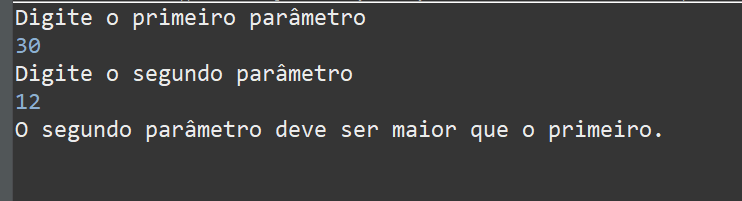

# Projeto Contador

O projeto Contador é uma aplicação simples em Java que recebe dois parâmetros do usuário e conta os números entre esses dois parâmetros, inclusive. Se o segundo parâmetro for menor que o primeiro, o programa lançará uma exceção.

## Como executar

Para executar o projeto, siga estas etapas:

1. Certifique-se de ter o Java instalado em sua máquina.
2. Baixe o código-fonte deste repositório.
3. Abra um terminal e navegue até o diretório onde o código-fonte foi baixado.
4. Compile o código-fonte usando o comando:

    ```
    javac Contador.java
    ```

5. Execute o arquivo compilado usando o comando:

    ```
    java Contador
    ```

6. Siga as instruções no terminal para inserir os parâmetros e ver a contagem.

## Exemplos de Uso

- **Exemplo 1:** Contagem de 12 a 30.

    ```bash
    Digite o primeiro parâmetro
    12
    Digite o segundo parâmetro
    30
    ```

    Saída:

   
    

- **Exemplo 2:** Contagem de 30 a 12 Exception.

    ```bash
    Digite o primeiro parâmetro
    30
    Digite o segundo parâmetro
    12
    ```

    Saída:

    

## Exceções

Se o segundo parâmetro fornecido for menor que o primeiro, uma exceção será lançada com a mensagem "O segundo parâmetro deve ser maior que o primeiro."

## Autor
Este programa foi desenvolvido por Jesimiel Silva.

## Iniciativa
DIO - Digital Innovation One. Visite [Meu Perfil](https://www.dio.me/users/jesimielbarbosa/).
